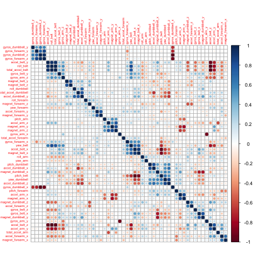
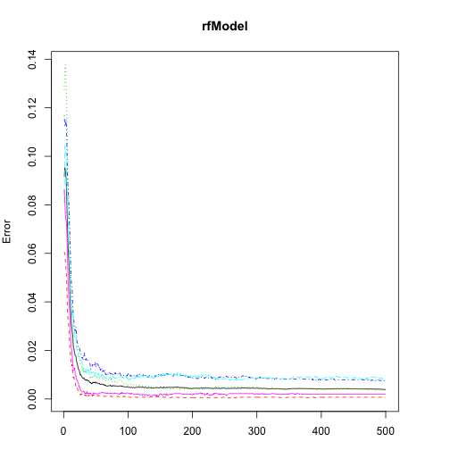
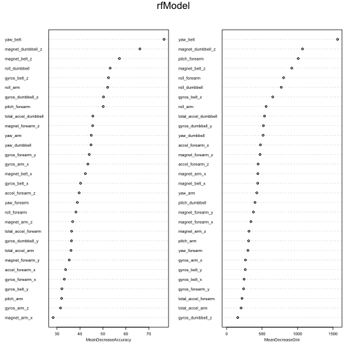

Weight Lifting Style Prediction Using Accelerometer Data
========================================================

## Introduction

We are examining if we can determine the weight lifting style using the accelerometer data from our dataset.

## Approaching the problem

We removed the variables with the highest missing values, then we looked for variables with high correlation (which can increase the error rate of misclassification). Then we chose the randomForest algorithm because it uses the bragging method which is low bias and high variance.

## Data preparation

Load dataset

```
## Loading required package: lattice
## Loading required package: ggplot2
## randomForest 4.6-7
## Type rfNews() to see new features/changes/bug fixes.
```


```r
train <- read.csv("pml-training.csv", stringsAsFactor = FALSE, skip = 0, fill = NA, 
    comment.char = "#")
test <- read.csv("pml-testing.csv")


var <- names(train)[apply(train, 2, function(x) table(is.na(x))[1] == 19622)]
train <- train[, var]
test <- test[, var[-length(var)]]

var <- melt(apply(train, 2, function(x) sum(ifelse(x == "", 1, 0))) == 0)
select.var <- rownames(var)[var$value == TRUE]
train <- train[, select.var]
classe <- train$classe
test <- test[, select.var[-length(select.var)]]
train <- train[, names(train[-c(1:7, length(train))])]
test <- test[, names(test[-c(1:7)])]
```

## Correlations
We look for correlations:


```r
correlations <- cor(train)
corrplot(correlations, order = "hclust", tl.cex = 0.5)
```

 

```r
highCorr <- findCorrelation(correlations, cutoff = 0.75)
predictor <- train[, -highCorr]
filtered.test <- test[, -highCorr]
trainData <- cbind(classe, predictor)
```


##Prediction
Using the Random Forest algorithm...

```r
rfModel <- randomForest(classe ~ ., data = trainData, importance = TRUE, ntrees = 10)
par(mar = c(3, 4, 4, 4))
plot(rfModel)
```

 

```r
varImpPlot(rfModel, cex = 0.5)
```

 

```r
out.test <- predict(rfModel, filtered.test)
```


## Conclusion
We are able to predict the type of lifting that is done by looking at the accelerometer data.
